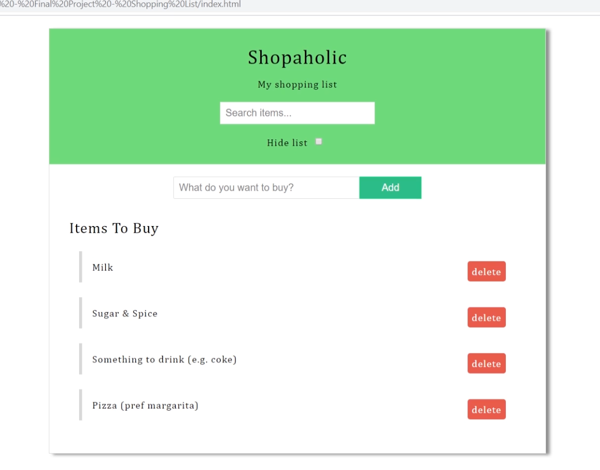

# Shoping List Project

From Clyde's DOM manipulation course.

## Stories

1. User can add items to the shopping list
    - User add items using an input field
    - Once added an item it's added to the list and it has a 'delete' button to the right
    - When user hovers over item left border changes color
1. User can delete items from the shopping list
    - User removes item from list by clicking 'delete' button
1. User can hide list
    - User hides list by clicking a checkbox at the top of the list labeled 'hide list'
1. User can search items in shopping list. Only search items display
    - User searches items using an input field without submit button or farther action. Case insensitive.

